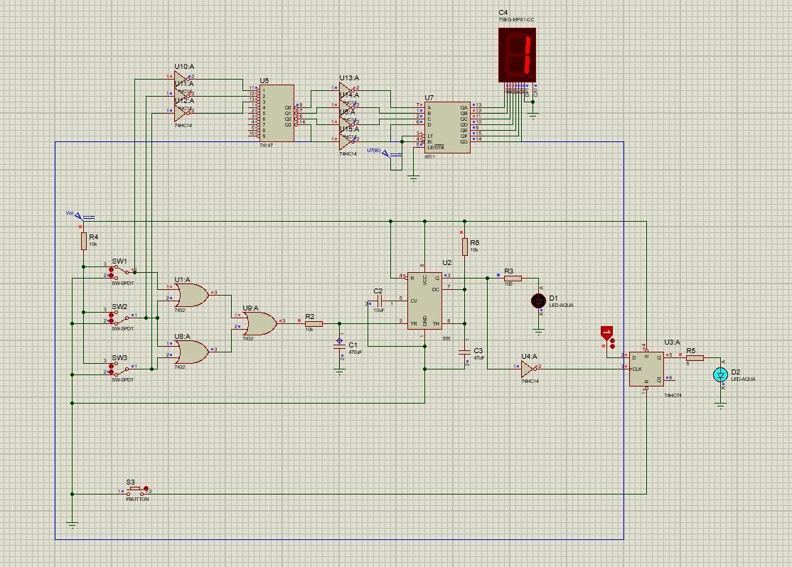
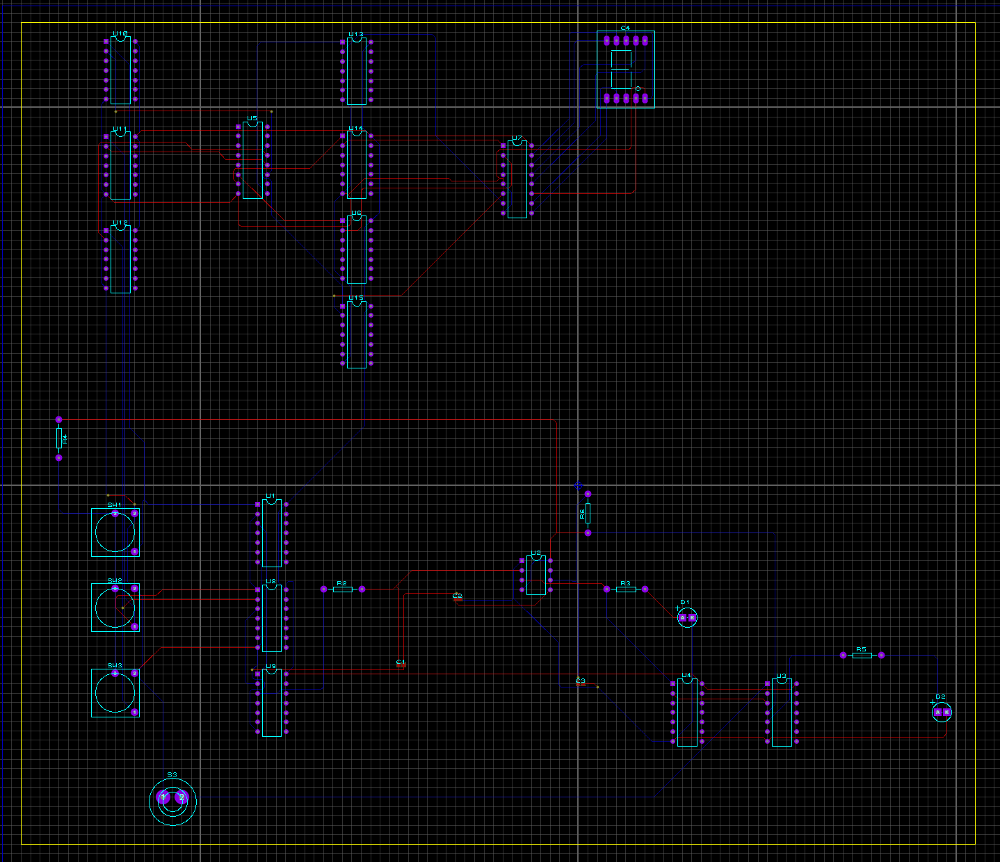
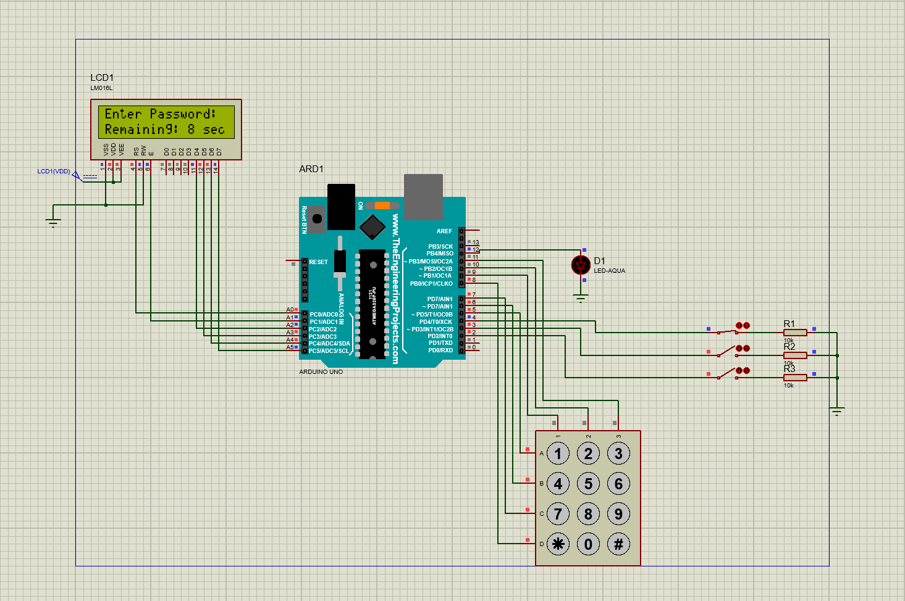

# 🏠 Home Security & Monitoring System

This project presents the design and simulation of a **Home Security and Monitoring System** using two different approaches:  

1. **Digital Logic Circuit Design** (RC filters, 555 timer, Schmitt triggers, flip-flops, encoders/decoders, 7-segment display)  
2. **Microcontroller-based System** (Arduino Uno, keypad, LCD, embedded C code)  

The system detects unauthorized entry via **door and window sensors**, and triggers a visual alarm when intrusion occurs. A keypad-based password mechanism is also included for secure arming/disarming.

---

## 📌 Features

- 🔒 **Digital Logic Circuit**
   <p align="center">
  
  
   </p>
  - RC filters to reduce signal noise  
  - 555 timer for entry/exit delay simulation  
  - Schmitt triggers for stable logic levels  
  - Flip-flop latch for armed/disarmed state  
  - 7-segment display for status indication  

- ⚡ **Microcontroller (Arduino)**
   
  - 4x3 Keypad for password input  
  - LCD (16x2) for system messages & countdown timer  
  - Alarm LED for intrusion detection  
  - Configurable access time (10s by default)  

---

## 🛠️ Components Used

### Digital Logic Design
- 555 Timer (monostable mode)  
- RC filters, Schmitt triggers (74HC14)  
- Flip-flops (74HC74)  
- Encoder (74147), Decoder (4511)  
- LED indicators, push button, switches  

### Microcontroller Design
- Arduino Uno  
- 16x2 LCD Display  
- 4x3 Keypad  
- LED (alarm indicator)  
- Switches (simulating door & windows)  

---

## 🚀 Simulation

The project was developed and tested in **Proteus** simulation software.  

- **Digital Logic Part:** Intrusion triggers alarm after entry delay, displayed on 7-segment.  
- **Arduino Part:** Password-protected system with LCD display and real-time feedback.  

🔗 Example Video: [Breadboard Circuit Demo](https://www.youtube.com/embed/KFViYoGXsv4?feature=oembed)  

---

## 🔧 Setup & Usage

1. Clone the repository:
   ```bash
   git clone https://github.com/cansu-oznur-avci1/Home-Security-Module-Project.git
   ```

2. For the **Digital Logic Design**:  
   - Open Proteus simulation files.  
   - Run the circuit and test door/window switches.  

3. For the **Arduino Design**:  
   - Upload `module-project-micro-code.ino` to Arduino Uno.  
   - Connect LCD, keypad, and switches as described.  
   - Run Proteus simulation or real hardware setup.  

---

## 📊 Results & Observations

- Both implementations successfully detect intrusion and activate alarms.  
- The **logic circuit** demonstrates fundamental digital system design principles.  
- The **Arduino version** provides flexibility, easier modifications, and password-protected access.  

**Future Improvements:**
- Add buzzer for audible alarms.  
- GSM/Wi-Fi module for remote SMS/email notifications.  
- More sensors (motion, fire, gas) for extended monitoring.  
